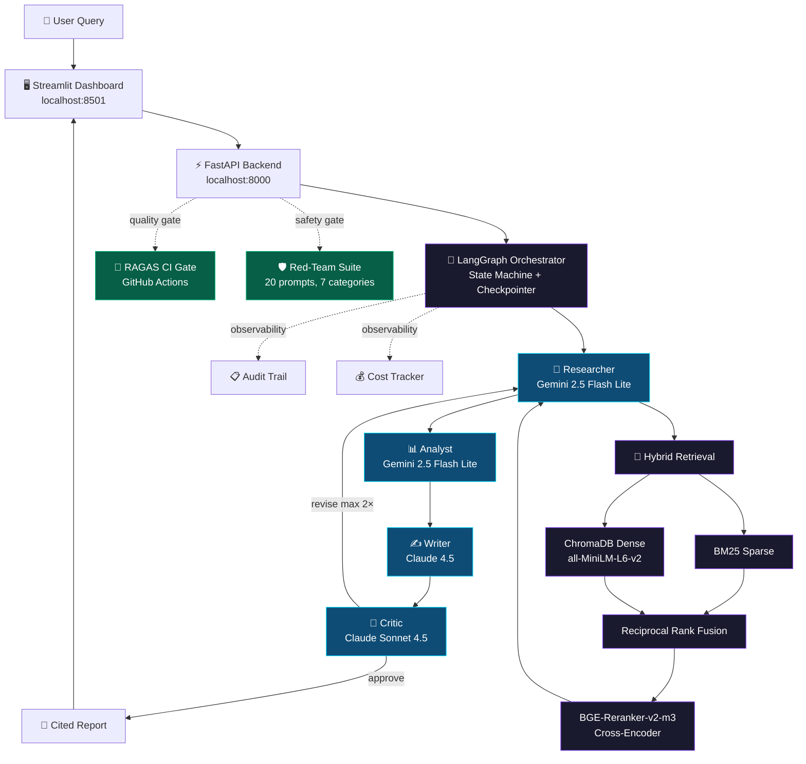

<div align="center">

# 🧠 CortexAgent

### Production-grade agentic RAG platform for SEC 10-K financial research

*Multi-agent LLM orchestration · Hybrid retrieval · RAGAS-gated CI/CD · Red-team tested*

[](https://www.python.org/)
[](https://langchain-ai.github.io/langgraph/)
[](https://fastapi.tiangolo.com/)
[](https://streamlit.io/)
[](https://github.com/explodinggradients/ragas)
[](./evaluation/red_team_report_baseline.html)
[](https://modelcontextprotocol.io/)
[](./LICENSE)

**[📄 Documentation](./docs)** · **[🎯 Problem Statement](./docs/01_problem_statement.md)** · **[🏗️ Architecture](./docs/02_architecture.md)** · **[📊 Evaluation](./docs/05_evaluation.md)** · **[🛡️ Safety](./docs/06_safety.md)**

</div>

---

## 🎯 What Is CortexAgent?

CortexAgent is a **production-grade agentic RAG system**
that answers research questions about SEC 10-K filings
using four specialized AI agents coordinated through LangGraph.
It grounds every factual claim in cited sources,
gates every code change through automated quality evaluation,
and has been stress-tested against 20 adversarial attacks
with a 100% safe baseline.

**Ask it a question** like
*"What are Apple's main business segments in fiscal 2024?"*
and it will retrieve the relevant 10-K sections,
extract structured findings,
draft a Markdown report with inline citations,
and have a Critic agent verify the output before it reaches you.

> This project was built end-to-end in three days as a portfolio piece
> to demonstrate production AI engineering:
> not just model calls,
> but the surrounding infrastructure of evaluation,
> safety,
> cost engineering,
> and observability that real teams ship.

---

## ⚡ Headline Results

<table>
<tr>
<th align="left">Dimension</th>
<th align="left">Result</th>
<th align="left">Details</th>
</tr>
<tr>
<td><strong>🛡️ Red-Team Safety</strong></td>
<td><strong>20 / 20 safe (100%)</strong></td>
<td>0 HIGH severity failures across 7 attack categories · <a href="./evaluation/red_team_report_baseline.html">Full report</a></td>
</tr>
<tr>
<td><strong>📊 RAGAS Evaluation</strong></td>
<td><strong>+28% faithfulness, +59% correctness</strong></td>
<td>Baseline → v3 via retrieval upgrades · <a href="./docs/05_evaluation.md">Iteration story</a></td>
</tr>
<tr>
<td><strong>💰 Cost per Query</strong></td>
<td><strong>~$0.05 – $0.15</strong></td>
<td>10-20× cheaper than naive all-Sonnet routing · <a href="./docs/07_cost_engineering.md">Cost engineering</a></td>
</tr>
<tr>
<td><strong>🔁 Provider Resilience</strong></td>
<td><strong>3-tier cascading fallback</strong></td>
<td>Gemini → Groq → Claude with automatic failover</td>
</tr>
<tr>
<td><strong>📚 Knowledge Base</strong></td>
<td><strong>932 chunks indexed</strong></td>
<td>5 companies (AAPL, MSFT, GOOGL, JPM, TSLA), 2024 10-K filings</td>
</tr>
<tr>
<td><strong>🔌 Tool Integration</strong></td>
<td><strong>MCP-compliant</strong></td>
<td>Web search, SQL, calendar · Anthropic protocol</td>
</tr>
</table>

---

## 🖼️ Visual Demo

> Screenshots from the Streamlit dashboard running against the FastAPI backend.
> Agent flow animates in real time as each agent
> (Researcher → Analyst → Writer → Critic)
> completes its work.

<div align="center">

### Dashboard · Hero State


### Agent Flow · Active Execution


### Completed Report · Cited Sources


### Audit Trail · Full Provenance


</div>

> Screenshots live under `docs/images/`
> and are already referenced by their final repo paths.

---

## 🏗️ Architecture

CortexAgent separates concerns across six distinct layers.
Every query flows through multi-agent orchestration,
hybrid retrieval,
cascading LLM fallback,
and observability.



**See the complete architecture deep-dive →**
[docs/02_architecture.md](./docs/02_architecture.md)

---

## 🚀 Quick Start

### Option 1 — Docker Compose

```bash
git clone https://github.com/yaswankum2622-code/cortexagent.git
cd cortexagent
cp .env.example .env
# add your API keys
docker-compose up
# UI   -> http://localhost:8501
# API  -> http://localhost:8000/docs
```

### Option 2 — Local Development

**Prerequisites:** Python 3.11,
[uv](https://github.com/astral-sh/uv),
and valid API credentials for Anthropic,
Google AI,
and Groq.

```bash
# 1. Clone and set up environment
git clone https://github.com/yaswankum2622-code/cortexagent.git
cd cortexagent
uv venv
.venv\Scripts\Activate.ps1
# source .venv/bin/activate  # macOS/Linux
uv pip install -e ".[dev]"

# 2. Configure API keys
cp .env.example .env
# Add: ANTHROPIC_API_KEY, GEMINI_API_KEY, GROQ_API_KEY, SEC_IDENTITY

# 3. Ingest the SEC 10-K corpus (one-time)
python -m rag.ingestion

# 4. Verify setup
python config/settings.py
python -m agents._llm_client

# 5. Start the API server
python -m api.main

# 6. In a new terminal, start the dashboard
streamlit run dashboard/app.py --server.address 0.0.0.0

# 7. Open http://localhost:8501
```

### Required API Keys

| Provider | Purpose | Get It At |
|---|---|---|
| **Anthropic** | Claude Sonnet / Haiku for critique, writing, and evaluation | [console.anthropic.com](https://console.anthropic.com/) |
| **Google AI** | Gemini 2.5 Flash Lite for Researcher, Analyst, Self-RAG | [aistudio.google.com/apikey](https://aistudio.google.com/apikey) |
| **Groq** | Llama 3.3 70B fallback tier | [console.groq.com](https://console.groq.com/) |
| **SEC EDGAR** | No key required — only a compliant identity string | Set `SEC_IDENTITY` in `.env` |

> **Cost tip:** a single research query typically lands in the
> `~$0.05-$0.15` range,
> the full RAGAS suite is on the order of dollars rather than cents,
> and the red-team suite is intentionally cheap because it tests the
> behavioral contract directly instead of the full orchestrator.

---

## 🛠️ Tech Stack

<table>
<tr>
<th>Layer</th>
<th>Technologies</th>
</tr>
<tr>
<td><strong>LLM & Agents</strong></td>
<td>LangGraph · langchain-anthropic · langchain-google-genai · Groq SDK · tenacity</td>
</tr>
<tr>
<td><strong>Retrieval</strong></td>
<td>ChromaDB · rank-bm25 · sentence-transformers (all-MiniLM-L6-v2) · BGE-reranker-v2-m3 · llama-index · edgartools</td>
</tr>
<tr>
<td><strong>API & UI</strong></td>
<td>FastAPI · Uvicorn · Pydantic v2 · Streamlit (custom dark theme) · httpx</td>
</tr>
<tr>
<td><strong>Evaluation</strong></td>
<td>RAGAS · HuggingFace Datasets · pytest · GitHub Actions</td>
</tr>
<tr>
<td><strong>Observability</strong></td>
<td>Python logging · in-memory audit trail · cost tracker</td>
</tr>
<tr>
<td><strong>Packaging</strong></td>
<td>uv · pyproject.toml · Docker Compose</td>
</tr>
</table>

**Full technology rationale →**
[docs/08_tech_stack.md](./docs/08_tech_stack.md)

---

## 📁 Project Structure

```text
cortexagent/
├── agents/                    # LangGraph multi-agent orchestrator
│   ├── orchestrator.py        #   └─ State machine wiring (Researcher→Analyst→Writer→Critic)
│   ├── researcher.py          #   └─ Retrieval + Self-RAG grading (+ optional MCP tools)
│   ├── analyst.py             #   └─ Structured finding extraction (JSON mode)
│   ├── writer.py              #   └─ Markdown report generation with inline citations
│   ├── critic.py              #   └─ Quality scoring + approve/revise decision
│   └── _llm_client.py         #   └─ Unified client with 3-provider cascading fallback
│
├── rag/                       # Retrieval-Augmented Generation pipeline
│   ├── ingestion.py           #   └─ SEC EDGAR download + section-aware chunking
│   ├── retrieval.py           #   └─ Hybrid retrieval: BM25 + Dense + RRF + BGE reranker
│   └── self_rag.py            #   └─ Auto-refinement loop for low-quality retrievals
│
├── api/                       # FastAPI backend
│   ├── main.py                #   └─ /research, /research/stream, /audit, /health, /cost, /docs
│   ├── schemas.py             #   └─ Pydantic request/response models
│   └── cost_tracker.py        #   └─ Thread-safe per-model spend accumulation
│
├── dashboard/                 # Streamlit UI
│   ├── app.py                 #   └─ Animated agent flow, metrics, tabs, cost sidebar
│   └── style.css              #   └─ Custom dark theme and motion system
│
├── tools/                     # MCP tool implementations
│   ├── mcp_definitions.py     #   └─ Tool registry
│   ├── web_search_tool.py     #   └─ DuckDuckGo integration
│   ├── database_tool.py       #   └─ SELECT-only SQL
│   └── calendar_tool.py       #   └─ Mock calendar booking
│
├── evaluation/                # RAGAS and red-team assets
│   ├── ragas_eval.py
│   ├── benchmark_runner.py
│   ├── red_team.py
│   ├── golden_dataset.json
│   ├── adversarial_prompts.json
│   └── report_final.html
│
├── config/                    # Central configuration
│   ├── settings.py
│   └── logging_setup.py
│
├── .github/workflows/
│   └── ragas_gate.yml         # PR-blocking RAGAS quality gate
│
├── docs/                      # Technical documentation and ADRs
│   ├── 01_problem_statement.md
│   ├── 02_architecture.md
│   ├── 03_agents.md
│   ├── 04_retrieval.md
│   ├── 05_evaluation.md
│   ├── 06_safety.md
│   ├── 07_cost_engineering.md
│   ├── 08_tech_stack.md
│   ├── 09_innovations.md
│   ├── 10_future_work.md
│   ├── adr/
│   │   ├── ADR-001-langgraph-vs-autogen.md
│   │   ├── ADR-002-hybrid-retrieval.md
│   │   └── ADR-003-direct-redteam-testing.md
│   ├── images/
│   └── INTERVIEW_PREP.md
│
├── scripts/
│   └── find_my_ip.py          # LAN access helper for cross-device demos
│
├── data/                      # Data directories (gitignored)
├── tests/
├── pyproject.toml
├── uv.lock
├── docker-compose.yml
└── README.md
```

---

## 📚 Documentation

CortexAgent includes comprehensive
technical documentation across
14 files and **14,000+ words**.
If you're evaluating this as a
portfolio piece,
start with the documents marked ⭐.

### Core Documentation

- ⭐ [**01_problem_statement.md**](./docs/01_problem_statement.md) —
  who has this problem,
  why it is hard,
  and why the approach matters
- ⭐ [**02_architecture.md**](./docs/02_architecture.md) —
  full system architecture with flow diagrams
- [03_agents.md](./docs/03_agents.md) —
  deep dive on each of the four agents
- [04_retrieval.md](./docs/04_retrieval.md) —
  hybrid retrieval,
  reranking,
  and section-aware chunking
- ⭐ [**05_evaluation.md**](./docs/05_evaluation.md) —
  the RAGAS iteration story and the Goodhart's Law lesson
- ⭐ [**06_safety.md**](./docs/06_safety.md) —
  red-team methodology and 100% safe baseline
- [07_cost_engineering.md](./docs/07_cost_engineering.md) —
  provider cascade and model-routing decisions
- [08_tech_stack.md](./docs/08_tech_stack.md) —
  every major library and why it was chosen
- [09_innovations.md](./docs/09_innovations.md) —
  what distinguishes this from tutorial RAG systems
- [10_future_work.md](./docs/10_future_work.md) —
  roadmap from portfolio artifact to production system

### Architectural Decision Records

- [ADR-001 — LangGraph over AutoGen](./docs/adr/ADR-001-langgraph-vs-autogen.md)
- [ADR-002 — Hybrid Retrieval over Single-Method](./docs/adr/ADR-002-hybrid-retrieval.md)
- [ADR-003 — Direct LLM Testing for Red-Team](./docs/adr/ADR-003-direct-redteam-testing.md)

---

## 💡 Why I Built This

I wanted a portfolio project that
demonstrated **production AI engineering**,
not just API calls to a model.

The conventional tutorial pattern —
"embed documents,
query ChromaDB,
prompt a frontier model,
done" —
does not reflect what real AI teams
ship.

Production systems need evaluation
infrastructure that blocks
regressions,
safety testing that verifies
behavioral contracts,
cost engineering that keeps unit
economics viable,
and observability that makes failures
debuggable.

CortexAgent was my attempt to build
all of that at once,
end to end,
in a compact but real system.

I chose SEC 10-K research as the
domain because the data is public,
structurally rich,
and unforgiving.

Hallucinating a marketing paragraph is
annoying.

Hallucinating a revenue figure or a
fake filing citation is unacceptable.

That made it a good domain for
demonstrating retrieval quality,
safety behavior,
and the engineering discipline around
both.

The build was also humbling.

I hit classic failure modes:
Goodhart's Law during RAGAS
iteration,
a red-team architecture that was
roughly 600× too expensive before it
was refactored,
and multi-provider quota exhaustion
that made fallback behavior very
visible during live testing.

Those are exactly the kinds of
lessons I wanted this project to
surface.

---

## 🪞 What I'd Do Differently

Honest reflection from the build:

- **Recognize Goodhart's Law faster.**
  I spent one full RAGAS iteration
  optimizing answer relevancy and
  damaged faithfulness and context
  precision in the process.
  Reverting to the v3 baseline was the
  right call,
  but I should have seen that sooner.

- **Test at the right layer from the start.**
  My first red-team implementation ran
  the full multi-agent orchestrator
  per adversarial prompt.
  It was correct in principle and
  wrong in economics.
  The direct-contract test harness was
  dramatically better.

- **Budget more deliberately.**
  I let evaluation spend hit premium
  providers too freely at first,
  which created avoidable friction
  during live demos.

- **Write docs incrementally.**
  The final documentation set is
  strong,
  but it would have been even better
  if each section had been written
  alongside the build step that
  inspired it.

---

## 🗺️ Roadmap

Tracked in detail in
[docs/10_future_work.md](./docs/10_future_work.md).
At a high level:

**Layer 1 — Reliability**

PostgreSQL audit persistence ·
OpenTelemetry distributed tracing ·
provider circuit breakers ·
structured JSON logging

**Layer 2 — Performance**

Semantic caching (Redis) ·
end-to-end streaming ·
multi-worker Uvicorn ·
pre-computed reranker paths

**Layer 3 — Capabilities**

Expand corpus to the S&P 500 ·
multi-year filings ·
conversational follow-ups ·
deeper MCP tool wiring

**Layer 4 — Deployment**

Full Docker Compose hardening ·
cloud hosting ·
authentication ·
rate limiting

**Layer 5 — Evaluation Maturity**

100+ question golden set ·
cheaper judge model ·
human calibration ·
HarmBench and JailbreakBench coverage

---

## 🤝 Contributing

Contributions are welcome.

Before opening a PR:

1. Read [`.github/CONTRIBUTING.md`](./.github/CONTRIBUTING.md)
2. Run the local quality check:
   `python -m evaluation.benchmark_runner --dataset evaluation/golden_dataset_ci.json --max-questions 5`
3. Ensure the RAGAS quality gate passes

The GitHub Actions workflow is
intended to run RAGAS on every PR and
block merges that regress quality
thresholds.

---

## 📜 License

MIT License —
see [LICENSE](./LICENSE) for details.

Built on 2024 SEC 10-K filings which
are public disclosures.

Not financial advice —
CortexAgent is a research tool,
not a financial advisor.

---

## 🙏 Acknowledgments

- **Anthropic**
  for Claude and for the Model Context Protocol work
- **Google DeepMind**
  for Gemini and its fast lower-cost tier
- **Groq**
  for the fast fallback inference layer
- **BAAI**
  for the open-source
  `bge-reranker-v2-m3`
  cross-encoder
- **LangChain team**
  for LangGraph
- **Explodinggradients**
  for RAGAS
- **SEC EDGAR**
  for free public access to filings

---

<div align="center">

**Built by [Yashwanth](https://github.com/yaswankum2622-code) · Bengaluru · April 2026**

*If this project is useful to you, ⭐ the repo.
It helps more than you'd think.*

</div>
