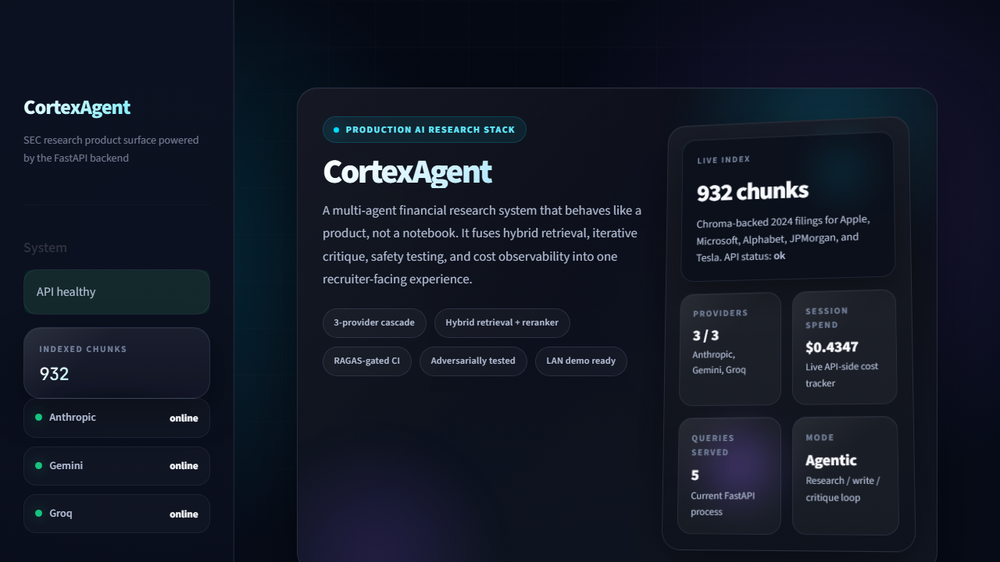
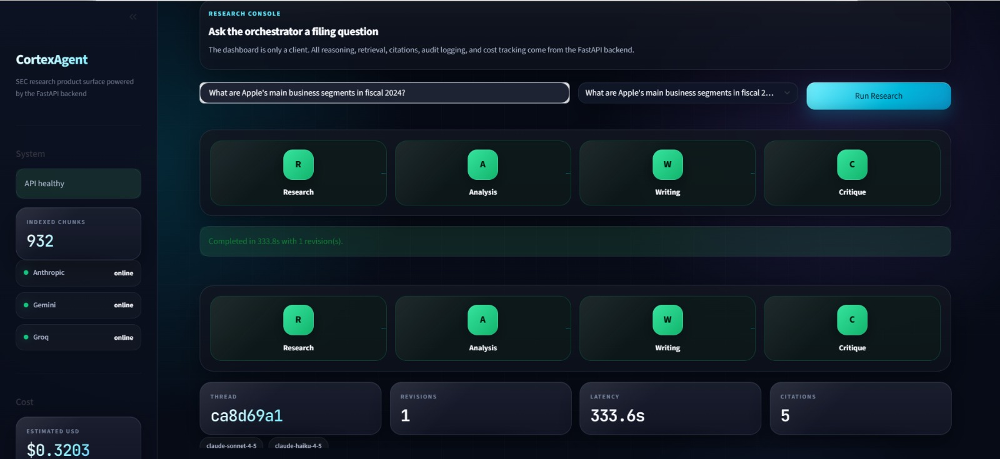
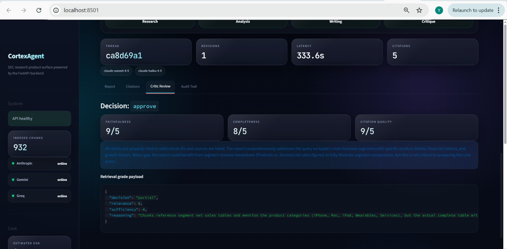
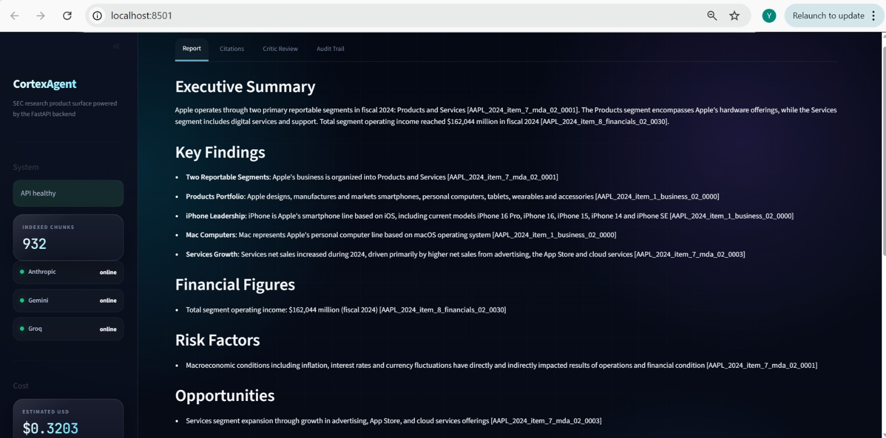
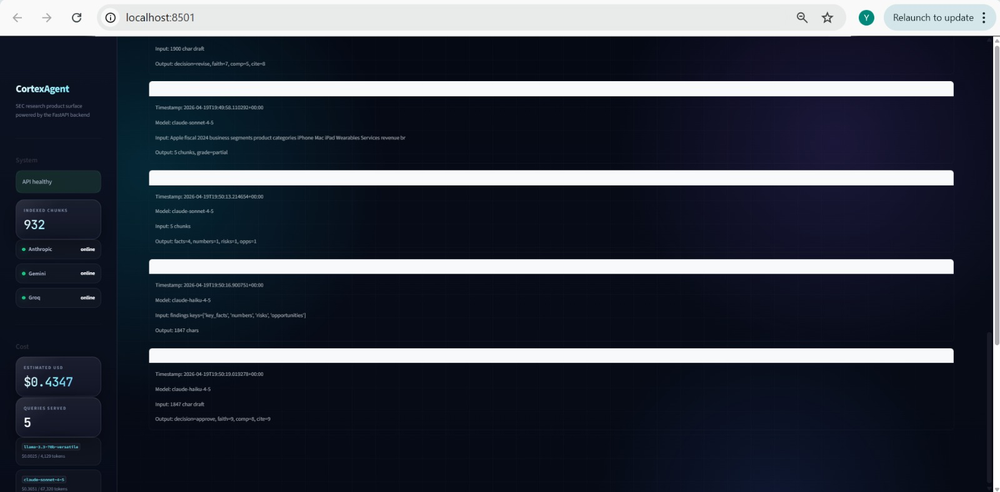
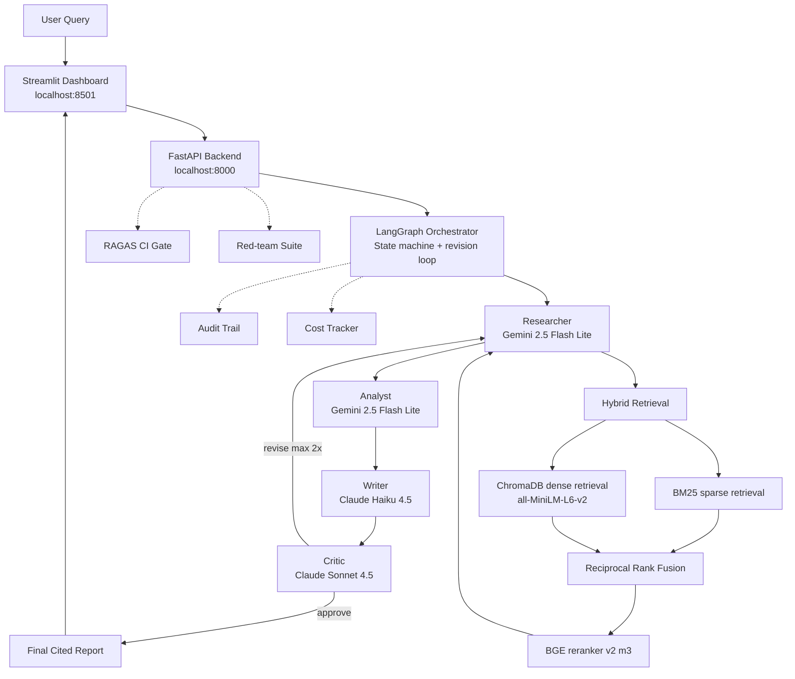

<div align="center">

# :brain: CortexAgent

### Production-grade agentic RAG platform for SEC 10-K financial research

*Multi-agent orchestration | Hybrid retrieval | RAGAS-gated CI/CD | Red-team tested*

[](https://www.python.org/)
[](https://langchain-ai.github.io/langgraph/)
[](https://fastapi.tiangolo.com/)
[](https://streamlit.io/)
[](https://github.com/explodinggradients/ragas)
[](./evaluation/red_team_report_baseline.html)
[](https://modelcontextprotocol.io/)
[](./LICENSE)

**[Documentation](./docs)** | **[Problem Statement](./docs/01_problem_statement.md)** | **[Architecture](./docs/02_architecture.md)** | **[Evaluation](./docs/05_evaluation.md)** | **[Safety](./docs/06_safety.md)** | **[Deployment](./docs/DEPLOYMENT.md)**

</div>

---

## :dart: What Is CortexAgent?

CortexAgent is a production-grade agentic RAG system that answers research questions about SEC 10-K filings using four specialized AI agents coordinated through LangGraph. It grounds every factual claim in cited filing chunks, routes work through a Critic review loop before returning an answer, and treats model quality like a release gate instead of a vibe check.

Ask a question like `What are Apple's main business segments in fiscal 2024?` and the system retrieves the relevant 10-K sections, extracts structured findings, drafts a research report, scores the result for quality, and exposes the evidence trail in the UI.

This repo was built as a flagship portfolio project for production AI engineering. The point is not only the model call. The point is the surrounding system: retrieval quality, evaluation, safety, observability, cost control, deployment, and operator-facing tooling.

---

## :zap: Headline Results

| Dimension | Result | Details |
|---|---|---|
| Red-team safety | **20 / 20 safe (100%)** | `0` HIGH severity failures across 7 attack categories. [Full report](./evaluation/red_team_report_baseline.html) |
| RAGAS evaluation | **+28% faithfulness, +59% correctness** | Baseline to v3 after retrieval and reranking upgrades. [Iteration story](./docs/05_evaluation.md) |
| Cost per query | **~$0.05 - $0.15** | Lower-cost routed stack instead of naive premium-model-everywhere usage. [Cost engineering](./docs/07_cost_engineering.md) |
| Provider resilience | **3-tier cascading fallback** | Gemini -> Groq -> Claude, with automatic failover |
| Knowledge base | **932 chunks indexed** | AAPL, MSFT, GOOGL, JPM, and TSLA 2024 10-K filings |
| Tool integration | **MCP-compliant** | Web search, SQL, and calendar tools via MCP-style contracts |

---

## :camera: Product Walkthrough

The README now tells the story as one complete run, not a loose gallery. These five screenshots walk from the opening product surface to the final audit trail so a recruiter can understand the system before reading a line of code.

### 1. Opening state: product surface and live system status

<div align="center">
  
</div>

The opening screen does more than look polished. It immediately communicates what the product is, how many chunks are indexed, whether the API is healthy, which providers are online, and how much the current session has spent. That makes the dashboard feel like a real product surface instead of a thin prompt box.

### 2. Live run: the four-agent pipeline in motion

<div align="center">
  
</div>

This is the first moment the system shows its architecture in action. You can see the user query, the orchestrated Researcher -> Analyst -> Writer -> Critic flow, revision count, total latency, and citation volume for a real Apple 2024 filing question. It makes the agent graph tangible.

### 3. Critic review: quality is inspected before the answer ships

<div align="center">
  
</div>

This screen is the key differentiator. Instead of blindly trusting the draft, CortexAgent surfaces the Critic decision, quality scores, and retrieval-grade payload. That makes the revision loop visible and shows that the system can evaluate its own output before it reaches the user.

### 4. Citations: the answer is grounded in filing evidence

<div align="center">
  
</div>

The citations view is where the project earns trust. Each returned answer is backed by exact chunk identifiers, filing sections, and excerpt previews from the underlying 10-K corpus. That is what turns the system from a generic chatbot into a usable financial research tool.

### 5. Audit trail: every model step is inspectable after the run

<div align="center">
  
</div>

The final screen closes the loop. It shows the per-step model trace, timestamps, and summarized inputs and outputs for each agent pass. This is the operational view that matters when debugging failures, explaining cost, or demonstrating observability in an interview.

---

## :building_construction: Architecture

CortexAgent separates the product into six layers: UI, API, orchestration, retrieval, evaluation, and operational instrumentation.



**Deep dive:** [docs/02_architecture.md](./docs/02_architecture.md)

---

## :rocket: Quick Start

### Option 1 - Docker Compose (recommended)

Requires [Docker Desktop](https://www.docker.com/products/docker-desktop/).

```bash
git clone https://github.com/yaswankum2622-code/cortexagent.git
cd cortexagent
cp .env.example .env
# Edit .env and add your API keys

docker-compose up -d
docker-compose exec api python -m rag.ingestion
```

Then open `http://localhost:8501`.

Full deployment guide: [docs/DEPLOYMENT.md](./docs/DEPLOYMENT.md)

### Option 2 - Local Development

Prerequisites:

- Python 3.11
- [uv](https://github.com/astral-sh/uv)
- Anthropic, Google AI, and Groq credentials

```bash
git clone https://github.com/yaswankum2622-code/cortexagent.git
cd cortexagent
uv venv
.venv\Scripts\Activate.ps1
# source .venv/bin/activate  # macOS/Linux

uv pip install -e ".[dev]"
cp .env.example .env

python -m rag.ingestion
python -m api.main
streamlit run dashboard/app.py --server.address 0.0.0.0
```

You can also use the helper scripts:

- PowerShell: `.\scripts\setup.ps1`
- Bash: `bash scripts/setup.sh`

### Required API Keys

| Provider | Purpose | Get It At |
|---|---|---|
| Anthropic | Critic, Writer, and RAGAS judge | [console.anthropic.com](https://console.anthropic.com/) |
| Google AI | Researcher, Analyst, and Self-RAG | [aistudio.google.com/apikey](https://aistudio.google.com/apikey) |
| Groq | Fallback LLM tier for resilience and latency | [console.groq.com](https://console.groq.com/) |
| SEC EDGAR | Identity string only, no signup key | Set `SEC_IDENTITY` in `.env` |

> Cost tip: a typical research query lands in the `$0.05-$0.15` range, while full offline evaluation and red-team runs are intentionally separated so development feedback stays affordable.

---

## :clapper: Quick Demo

Want to show the system end-to-end without opening the full UI first?

```bash
python scripts/run_demo.py
```

That command runs two representative queries through the full multi-agent pipeline and prints a screen-share-friendly summary of latency, model usage, critique scores, citations, and estimated cost.

Useful variants:

- `python scripts/run_demo.py --single`
- `make demo`
- `make demo-single`

If you want the full stack instead:

```bash
# Terminal 1
python -m api.main

# Terminal 2
streamlit run dashboard/app.py --server.address 0.0.0.0

# Terminal 3
python scripts/find_my_ip.py
```

Then open `http://localhost:8501` or the LAN URL printed by the helper script.

---

## :toolbox: Tech Stack

| Layer | Technologies |
|---|---|
| LLM and agents | LangGraph, langchain-anthropic, langchain-google-genai, Groq SDK, tenacity |
| Retrieval | ChromaDB, rank-bm25, sentence-transformers, BGE reranker, llama-index, edgartools |
| API and UI | FastAPI, Uvicorn, Pydantic v2, Streamlit, httpx |
| Evaluation | RAGAS, Hugging Face Datasets, pytest, GitHub Actions |
| Observability | Structured logging, audit trail, cost tracker |
| Packaging | uv, Docker, Docker Compose, Makefile |

**Rationale:** [docs/08_tech_stack.md](./docs/08_tech_stack.md)

---

## :open_file_folder: Project Structure

```text
cortexagent/
|-- agents/                       # LangGraph orchestration and agent implementations
|   |-- orchestrator.py
|   |-- researcher.py
|   |-- analyst.py
|   |-- writer.py
|   |-- critic.py
|   `-- _llm_client.py
|-- rag/                          # Chunking, retrieval, reranking, self-RAG
|   |-- ingestion.py
|   |-- retrieval.py
|   |-- reranker.py
|   `-- self_rag.py
|-- api/                          # FastAPI backend and schemas
|   |-- main.py
|   |-- schemas.py
|   `-- cost_tracker.py
|-- dashboard/                    # Streamlit dashboard and theme
|   |-- app.py
|   `-- style.css
|-- tools/                        # MCP-style tools
|   |-- mcp_definitions.py
|   |-- web_search_tool.py
|   |-- database_tool.py
|   `-- calendar_tool.py
|-- evaluation/                   # RAGAS, red-team, baselines, datasets
|   |-- ragas_eval.py
|   |-- benchmark_runner.py
|   |-- red_team.py
|   |-- golden_dataset.json
|   |-- golden_dataset_ci.json
|   |-- adversarial_prompts.json
|   |-- report_final.html
|   `-- red_team_report_baseline.html
|-- docs/                         # Technical documentation, ADRs, screenshots
|   |-- 01_problem_statement.md
|   |-- 02_architecture.md
|   |-- 03_agents.md
|   |-- 04_retrieval.md
|   |-- 05_evaluation.md
|   |-- 06_safety.md
|   |-- 07_cost_engineering.md
|   |-- 08_tech_stack.md
|   |-- 09_innovations.md
|   |-- 10_future_work.md
|   |-- DEPLOYMENT.md
|   |-- INTERVIEW_PREP.md
|   |-- adr/
|   `-- images/
|-- scripts/                      # Setup, demo, and networking helpers
|   |-- setup.sh
|   |-- setup.ps1
|   |-- find_my_ip.py
|   `-- run_demo.py
|-- .github/
|   |-- ISSUE_TEMPLATE/
|   |-- pull_request_template.md
|   `-- workflows/
|-- CHANGELOG.md
|-- CONTRIBUTING.md
|-- CODE_OF_CONDUCT.md
|-- Dockerfile
|-- Dockerfile.streamlit
|-- docker-compose.yml
|-- Makefile
|-- pyproject.toml
`-- README.md
```

---

## :books: Documentation

Start here if you are reading the repo as a portfolio artifact:

- [docs/01_problem_statement.md](./docs/01_problem_statement.md) - target user, pain point, and product framing
- [docs/02_architecture.md](./docs/02_architecture.md) - system design and data flow
- [docs/03_agents.md](./docs/03_agents.md) - agent contracts and responsibilities
- [docs/04_retrieval.md](./docs/04_retrieval.md) - chunking, retrieval, and reranking
- [docs/05_evaluation.md](./docs/05_evaluation.md) - RAGAS iteration story and lessons learned
- [docs/06_safety.md](./docs/06_safety.md) - red-team methodology and baseline results
- [docs/07_cost_engineering.md](./docs/07_cost_engineering.md) - provider routing and spend control
- [docs/08_tech_stack.md](./docs/08_tech_stack.md) - library choices and tradeoffs
- [docs/09_innovations.md](./docs/09_innovations.md) - what makes this more than tutorial RAG
- [docs/10_future_work.md](./docs/10_future_work.md) - roadmap
- [docs/DEPLOYMENT.md](./docs/DEPLOYMENT.md) - local Docker and hosted deployment guidance
- [docs/INTERVIEW_PREP.md](./docs/INTERVIEW_PREP.md) - interview narrative and demo script

Architecture decision records:

- [ADR-001 - LangGraph over AutoGen](./docs/adr/ADR-001-langgraph-vs-autogen.md)
- [ADR-002 - Hybrid Retrieval](./docs/adr/ADR-002-hybrid-retrieval.md)
- [ADR-003 - Direct Red-Team Testing](./docs/adr/ADR-003-direct-redteam-testing.md)

Repository operations:

- [CHANGELOG.md](./CHANGELOG.md)
- [CONTRIBUTING.md](./CONTRIBUTING.md)
- [CODE_OF_CONDUCT.md](./CODE_OF_CONDUCT.md)

---

## :bulb: Why I Built This

I wanted a project that demonstrated production AI engineering, not just model usage. A lot of GenAI demos stop at document embeddings plus a prompt. That is not the hard part in a serious system. The hard part is proving that retrieval is grounded, behavior is testable, regressions are caught early, and the whole stack can be explained under pressure.

SEC 10-K research is a good domain for that. The data is public, structurally rich, and unforgiving. If a model invents a metric, a citation, or a management claim, the failure is obvious and unacceptable. That makes it a much better proving ground than generic Q and A.

The build also surfaced real engineering lessons: Goodhart's Law during RAGAS tuning, a red-team implementation that was initially far too expensive, and provider quota exhaustion that forced fallback logic to become a first-class feature rather than a line item.

---

## :mirror: What I'd Do Differently

- I would recognize metric gaming faster. One evaluation iteration improved answer relevance while hurting faithfulness and context precision, and the correct move was to revert sooner.
- I would design the red-team harness at the contract layer from day one instead of first running the full orchestrator per adversarial prompt.
- I would set clearer daily spend ceilings during evaluation runs to avoid burning premium provider credits during demo prep.
- I would write each major doc alongside the component build instead of batching the documentation late.

---

## :world_map: Roadmap

The detailed roadmap lives in [docs/10_future_work.md](./docs/10_future_work.md). The short version:

- Layer 1: Postgres audit persistence, structured JSON logs, circuit breakers, tracing
- Layer 2: Redis semantic caching, streaming, multi-worker serving, retrieval performance work
- Layer 3: Larger corpus coverage, multi-year filings, conversational follow-ups, deeper MCP usage
- Layer 4: Hosted deployment, authentication, rate limiting, stronger operational hardening
- Layer 5: Bigger golden datasets, cheaper judge strategy, human calibration, broader safety benchmarks

---

## :handshake: Contributing

Contributions are welcome, but this repo values coherent engineering stories over noisy drive-by edits.

Before opening a PR:

1. Read [CONTRIBUTING.md](./CONTRIBUTING.md)
2. Use the issue templates under [`.github/ISSUE_TEMPLATE/`](./.github/ISSUE_TEMPLATE/)
3. Use the PR checklist in [`.github/pull_request_template.md`](./.github/pull_request_template.md)
4. Run the most relevant local checks for your change

Helpful commands:

```bash
make test
make ragas-ci
make red-team
make docker-up
```

---

## :page_facing_up: License

MIT License. See [LICENSE](./LICENSE).

The corpus is built from public SEC filings. CortexAgent is a research system and portfolio artifact, not financial advice.

---

## :pray: Acknowledgments

- Anthropic for Claude and MCP ecosystem work
- Google DeepMind for Gemini and a strong lower-cost retrieval layer
- Groq for fast fallback inference
- BAAI for the `bge-reranker-v2-m3` cross-encoder
- LangChain for LangGraph
- Explodinggradients for RAGAS
- SEC EDGAR for public filing access

---

<div align="center">

**Built by [Yashwanth](https://github.com/yaswankum2622-code) | Bengaluru | April 2026**

*If the repo is useful, star it. That signal matters.*

</div>
