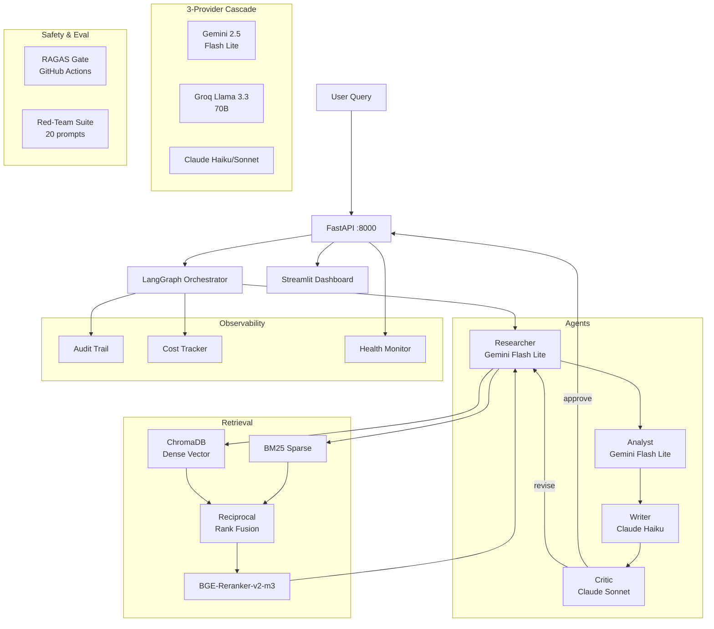

# CortexAgent Architecture

## 1. System Overview

CortexAgent is a layered
application,
not a single prompt.

The user interacts with a
FastAPI backend through either
`POST /research`
or
`POST /research/stream`,
and the backend delegates the query
to a LangGraph orchestrator.

That orchestrator coordinates four
specialized agents:
Researcher,
Analyst,
Writer,
and Critic.

The retrieval subsystem is separate
from the agent graph.

It combines BM25 sparse retrieval,
ChromaDB dense vector search using
`all-MiniLM-L6-v2`,
Reciprocal Rank Fusion,
and a
`BAAI/bge-reranker-v2-m3`
cross-encoder.

The corpus currently contains
932 indexed chunks across five
2024 filings:
AAPL,
MSFT,
GOOGL,
JPM,
and TSLA.

Model execution is routed through a
shared LLM client with a
three-provider cascade:
Gemini 2.5 Flash Lite as the cheap
front line,
Groq Llama 3.3 70B as the fast
secondary option,
and Claude Sonnet 4.5 or
Haiku 4.5 as the quality floor.

Observability is first-class.

Each node appends audit entries,
the API exposes `/audit/{thread_id}`
and `/cost`,
and health status is visible via
`/health`.

The project also ships with a
custom dark Streamlit UI that talks
to the API over `httpx`,
renders the agent flow,
and supports LAN demos by binding
services to `0.0.0.0`.

In other words,
the architecture is intentionally
split into product surface,
workflow control,
retrieval quality,
provider resilience,
and evaluation infrastructure.

## 2. Architecture Diagram

## 3. Data Flow: Query Lifecycle

The lifecycle starts when a client
submits a research request to
`POST /research`.

The request contains a natural
language query and may optionally
carry a thread identifier.

If the caller does not provide one,
the API generates a thread ID such as
`api_<uuid>`,
which becomes the primary handle for
audit lookup and streaming events.

FastAPI validates the payload with
Pydantic,
ensures the orchestrator is already
initialized inside the app lifespan,
and then hands control to the
LangGraph workflow on a background
thread.

The orchestrator initializes an
`AgentState` object.

At minimum,
that state contains the query,
`revision_count = 0`,
and an empty audit trail.

The first node is the Researcher.

The Researcher does not blindly call
the LLM first.

It runs hybrid retrieval,
then passes the retrieved chunks into
the Self-RAG grader.

The grader labels the retrieval as
`sufficient`,
`partial`,
or `insufficient`,
and may suggest a refined query.

If retrieval is weak,
the Researcher retries with the
refined query up to two times before
accepting the final evidence set.

Once the final chunks are chosen,
the Researcher writes concise
research notes grounded only in those
chunks.

The Analyst receives the query and
retrieved chunks from state.

Its job is not prose.

Its job is schema extraction.

It returns JSON for key facts,
numbers,
risks,
and opportunities.

Every item is supposed to point back
to a chunk identifier.

The Writer then converts those
structured findings into the final
user-facing Markdown report.

This is where sections such as
Executive Summary,
Key Findings,
Financial Figures,
Risk Factors,
Opportunities,
and Sources are created.

If the graph is already in a
revision cycle,
the Writer also sees the previous
Critic feedback and adjusts the new
draft accordingly.

The Critic is the decision gate.

It checks the draft against the valid
chunk IDs currently in state and
grades three dimensions:
faithfulness,
completeness,
and citation quality.

If the scores meet threshold,
the Critic returns `approve`.

If not,
it returns `revise`,
along with feedback and a
`revision_focus` string that narrows
what the next Researcher pass should
look for.

When the decision is `revise`,
LangGraph routes execution through
`prepare_revision`,
increments `revision_count`,
stores `revision_focus`,
and loops back to the Researcher.

This continues until the Critic
approves or the graph reaches
`MAX_REVISIONS = 2`.

At finalization time,
the orchestrator computes total agent
latency,
copies the current draft into
`final_report`,
and returns the completed state to
the API.

The API then normalizes citations,
extracts the distinct models used,
persists the in-memory audit trail by
thread ID,
increments the query counter in the
cost tracker,
and returns the response payload.

If the client uses
`/research/stream`,
the same logical flow occurs,
but node-level updates are emitted as
server-sent events so the UI can show
live progress.

## 4. State Management

State is represented as a
LangGraph `TypedDict`
called `AgentState`.

This is a practical choice because
the system is not just passing a
conversation transcript.

It is passing typed workflow state
that grows as each node adds
artifacts.

Tracked fields include:
`query`,
`retrieved_chunks`,
`retrieval_grade`,
`retrieval_retry_history`,
`research_notes`,
`structured_findings`,
`draft_report`,
`critique`,
`revision_count`,
`revision_focus`,
`final_report`,
`audit_trail`,
`total_latency_ms`,
and `wall_latency_ms`.

The graph uses a
`MemorySaver` checkpointer.

That gives each thread ID a distinct
state channel without forcing the
project to commit immediately to an
external durable store.

For a local demo and developer
workflow,
that is a clean compromise.

The important point is that CortexAgent
has an explicit state schema.

Every phase knows what it consumes,
what it produces,
and what survives across revision
loops.

## 5. Deployment Topology

The current development topology is
intentionally simple.

FastAPI runs as the orchestration and
API layer.

Streamlit runs as the presentation
layer.

ChromaDB persists vectors locally on
disk.

The reranker runs on CPU.

This setup is enough for end-to-end
development,
evaluation,
and live demos on a laptop.

The production target is a
Docker Compose deployment with at
least five services:
`api`,
`ui`,
`chromadb`,
`postgres`,
and `redis`.

In that shape,
PostgreSQL becomes the durable audit
store,
Redis handles session or semantic
cache workloads,
and the API can scale separately from
the UI.

The scale path after that is a
Kubernetes topology.

The orchestrator can run with
horizontal replicas,
while sharing a common vector store
such as a centralized ChromaDB
instance or a migration target like
Qdrant.

The core architectural point is that
the system already separates
stateful retrieval assets,
stateless request handling,
and user interface concerns.

That makes the transition from
portfolio project to deployable
service much more straightforward.
